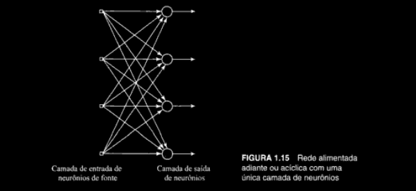
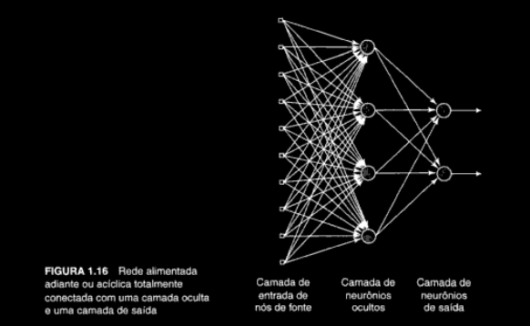
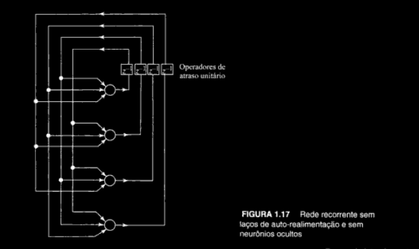
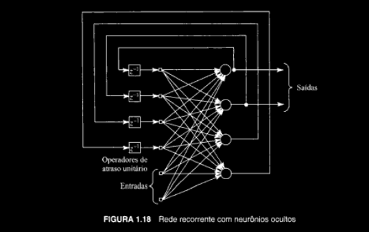

## Principais Arquiteturas de Redes Neurais

### 1. Redes Alimentadas Adiante com Camada Única:

### 2. Redes Alimentadas Diretamente com Múltiplas Camadas:
- também é alimentada adiante \

### 3. Redes Recorrentes
- possui laços de realimentação (diferindo de uma rede neural alimentada adiante);

